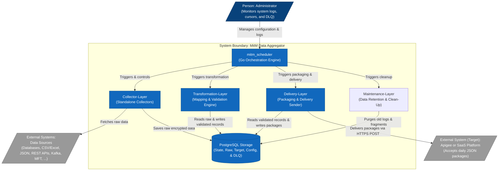

# Man-in-the-Middle (MitM) Data Aggregator

The **MitM Data Aggregator** is a secure, decoupled, and reliable Go-based ingestion and delivery pipeline. It collects raw data from heterogeneous source systems (such as databases, APIs, and CSV files), buffers it locally using Envelope Encryption (AES-GCM), groups them deterministically via Correlation IDs (Stateful Aggregation), transforms and validates the merged data into Golden Records, and aggregates it into JSON packages for batch delivery to a target SaaS platform.

<div align="center">

</div>

---

<!-- START doctoc generated TOC please keep comment here to allow auto update -->

<details>
<summary>Table of Contents</summary>

- [Project Overview](#project-overview)
- [Architecture & Core Components](#architecture-core-components)
- [Technologies Used](#technologies-used)
- [Getting Started / First Steps for Execution](#getting-started-first-steps-for-execution)
- [Conclusion of the MitM-Project](#conclusion-of-the-mitm-project)
- [🏗️ C4 System & Component Context](#-c4-system-component-context)
- [📂 Project Structure & Layers](#-project-structure-layers)
  - [1. MitM Scheduler](#1-mitm-scheduler)
  - [2. Collector Layer](#2-collector-layer)
  - [3. Transformation Layer](#3-transformation-layer)
  - [4. Delivery Layer](#4-delivery-layer)
  - [5. Admin Frontend](#5-admin-frontend)
  - [6. Maintenance Layer](#6-maintenance-layer)
- [🔒 Security & Key Management](#-security-key-management)
- [🛠️ Build and Running Instructions](#-build-and-running-instructions)
  - [1. Prerequisites](#1-prerequisites)
  - [2. Database Migrations](#2-database-migrations)
  - [3. Compiling the Components](#3-compiling-the-components)
  - [4. Running the Pipeline](#4-running-the-pipeline)

</details>

<!-- END doctoc generated TOC please keep comment here to allow auto update -->

## Project Overview

The **MitM (Man-in-the-Middle) Data Aggregator** project is a secure and decoupled data ingestion and delivery pipeline written primarily in Go (Golang). The system collects raw data from heterogeneous source systems (e.g., PostgreSQL, Oracle, CSV, APIs), encrypts it locally ("at-rest"), validates and transforms it, and finally sends it as aggregated JSON batches to a target SaaS platform (e.g., Apigee).

The project places high value on data security and the protection of personally identifiable information (PII) through the use of **Envelope Encryption** (AES-GCM with a two-tier key hierarchy: KEK and DEK) as well as crypto-shredding. PostgreSQL is used for data storage, buffering, and state management (e.g., cursors, dead letter queue).

## Architecture & Core Components

The system is divided into modularly decoupled layers that operate according to the "single responsibility" principle and are orchestrated by a central scheduler:

1. **Scheduler (`scheduler/mitm_scheduler`)**: The control instance of the system. It orchestrates the execution of collectors and delivery jobs based on dynamic cron schedules and provides a REST API.
2. **Collector Layer (`collector-layer/`)**: Independent collectors (e.g., `mitm_collector_pg`, `mitm_collector_ora`) that connect to source systems, retrieve raw data via cursors (state tracking), initially encrypt it, and store it as fragments.
3. **Transformation Layer (`transformation-layer/`)**: Reads the raw data, waits until all required source fragments for a `correlation_id` arrive, decrypts them, merges them into a Golden Record, applies dynamic mapping and validation rules, and stores the result for delivery.
4. **Delivery Layer (`delivery-layer/`)**: Bundles the validated records into daily JSON packages and securely sends them via HTTPS POST (including idempotency keys) to the target system. In case of errors, exponential backoff and a Dead Letter Queue (DLQ) are utilized.
5. **Maintenance Layer (`maintenance-layer/`)**: Responsible for enforcing data retention policies. It purges old logs, processed raw fragments, successfully delivered packages, and expired metrics.
6. **Admin Frontend (`admin-frontend/`)**: A separate C++ Qt application that serves as a visual management and monitoring interface (control plane) for administrators.

## Technologies Used

- **Backend**: Go 1.25.0+ (for performance, type safety, and single-binary deployments)
- **Frontend / UI**: C++ with Qt framework
- **Database & State Management**: PostgreSQL
- **Security / Cryptography**: AES-GCM (Master Key + Data Encryption Keys)
- **Monitoring & Logging**: Prometheus, `zerolog` (JSON)

## Getting Started / First Steps for Execution

1. **Database Migration**: Execute the SQL scripts from the `migrations/` directories of the respective layers in the PostgreSQL database.
2. **Compilation**: Build the Go components (such as the scheduler and collectors) individually via `go build`.
3. **Configuration & Startup**: Set the `MASTER_KEY` environment variable (KEK, exists only in RAM) and start the scheduler with the corresponding configuration file.

## Conclusion of the MitM-Project

The workspace contains a well-thought-out, scalable architecture designed for high security. The strict separation of data collection, processing, and delivery, combined with state-based polling (cursors), guarantees high resilience and fault tolerance. The documentation is detailed and professionally structured.

## 🏗️ C4 System & Component Context

The diagram below shows how the system boundaries are structured and how the components interact with administrators and external systems:



---

## 📂 Project Structure & Layers

The project is structured into separated, decoupled layers:

### 1. MitM Scheduler

- **Location**: [scheduler/README.md](./scheduler/README.md)
- **Role**: Orchestrates the execution of collectors and delivery jobs on dynamic cron schedules. It receives real-time execution feedback via a Unix domain socket IPC listener.

### 2. Collector Layer

- **Location**: [collector-layer/README.md](./collector-layer/README.md)
- **Role**: Autonomous collectors that connect to source systems, fetch raw data, apply initial AES-GCM envelope encryption, and insert them into the `raw_ingestion` landing table.

### 3. Transformation Layer

- **Location**: [transformation-layer/README.md](./transformation-layer/README.md)
- **Role**: Reads raw ingested records, waits for all required sources to arrive for a correlation ID, decrypts them, merges them into a Golden Record, applies mapping configurations, dynamic transformations, and validations, and writes target output fields to target tables.

### 4. Delivery Layer

- **Location**: [delivery-layer/README.md](./delivery-layer/README.md)
- **Role**: Aggregates target records into daily JSON batches (`packages`), executes secure delivery with HTTP idempotency key headers, handles transient errors via exponential backoff, and tracks failed messages inside the Dead Letter Queue (DLQ).

### 5. Admin Frontend

- **Location**: [admin-frontend/README.md](./admin-frontend/README.md)
- **Role**: Desktop Application for managing the MitM Data Aggregator.

### 6. Maintenance Layer

- **Location**: [maintenance-layer/README.md](./maintenance-layer/README.md)
- **Role**: Runs configurable clean-up jobs (`mitm_cleanup`) to purge old processed records, system logs, and delivered packages according to strict GDPR and data retention policies.

---

## 🔒 Security & Key Management

- **Envelope Encryption**: All Personally Identifiable Information (PII) data is encrypted at-rest.
- **Two-Tier Key Hierarchy**:
  - **Master Key (KEK)**: Cryptographically random key injected via the `MASTER_KEY` environment variable. Exists **only in RAM** and is never persisted.
  - **Data Encryption Key (DEK)**: Generated per fragment/source configuration and stored inside the database, encrypted with the KEK.
- **Crypto-Shredding**: By deleting the specific wrapped DEK from `storage_keys`, all data fragments encrypted with that key are instantly and irreversibly destroyed.

---

## 🛠️ Build and Running Instructions

### 1. Prerequisites

- Go 1.25.0 or later.
- PostgreSQL Server.

### 2. Database Migrations

Initialize the tables by running the SQL migration scripts in order:

```bash
# 1. Scheduler Init (job metadata, scheduling, http configuration, admin logs)
psql -h <host> -U <user> -d mitm -f scheduler/mitm_scheduler/migrations/001_init.sql
psql -h <host> -U <user> -d mitm -f scheduler/mitm_scheduler/migrations/002_logging_and_audit.sql
psql -h <host> -U <user> -d mitm -f scheduler/mitm_scheduler/migrations/003_admin_and_api.sql
psql -h <host> -U <user> -d mitm -f scheduler/mitm_scheduler/migrations/004_add_name_unique.sql
psql -h <host> -U <user> -d mitm -f scheduler/mitm_scheduler/migrations/006_rbac.sql

# 2. Collector Init (storage keys, source credentials, raw ingestion landing tables, cursors)
psql -h <host> -U <user> -d mitm -f collector-layer/migrations/001_raw_ingestions.sql

# 3. Transformation Init (mapping rules, target schemas, transformations, validations)
psql -h <host> -U <user> -d mitm -f transformation-layer/migrations/001_mapping_source.sql
psql -h <host> -U <user> -d mitm -f transformation-layer/migrations/001_mapping_target_field.sql
psql -h <host> -U <user> -d mitm -f transformation-layer/migrations/001_mapping_transformation.sql
psql -h <host> -U <user> -d mitm -f transformation-layer/migrations/001_mapping_validation.sql
psql -h <host> -U <user> -d mitm -f transformation-layer/migrations/001_mapping_rule.sql
psql -h <host> -U <user> -d mitm -f transformation-layer/migrations/006_transformation_errors.sql
psql -h <host> -U <user> -d mitm -f transformation-layer/migrations/007_target_fragments.sql
psql -h <host> -U <user> -d mitm -f transformation-layer/migrations/008_topic_dependencies.sql

# 4. Delivery Init (JSON packages, DLQ)
psql -h <host> -U <user> -d mitm -f delivery-layer/migrations/001_packages.sql
psql -h <host> -U <user> -d mitm -f delivery-layer/migrations/002_dead_letter_queue.sql
```

### 3. Compiling the Components

To build the scheduler:

```bash
cd scheduler/mitm_scheduler
go build -o ../../bin/scheduler ./cmd/scheduler
go build -o ../../bin/encrypt-config ./cmd/encrypt-config
```

To build the standalone employee collector:

```bash
cd collector-layer/mitm_collector_pg-employee
go build -o ../../bin/mitm-collector-pg-employee main.go
```

### 4. Running the Pipeline (End-to-End Test)

To verify the entire chain locally, we provide a complete End-to-End Orchestration script. 
It spins up a mock SaaS server, initializes database data, and runs the Collector, Transformation, and Delivery layers consecutively:

```bash
export MASTER_KEY="abcdefghijklmnopqrstuvwxyz123456"
bash test_e2e.sh
```

Alternatively, to start the production scheduler with your encrypted configuration:

```bash
export MASTER_KEY="Y29uZmlkZW50aWFsX21hc3Rlcl9rZXlfMzJfYnl0ZXM="
./bin/scheduler /path/to/encrypted_config.json.enc
```
