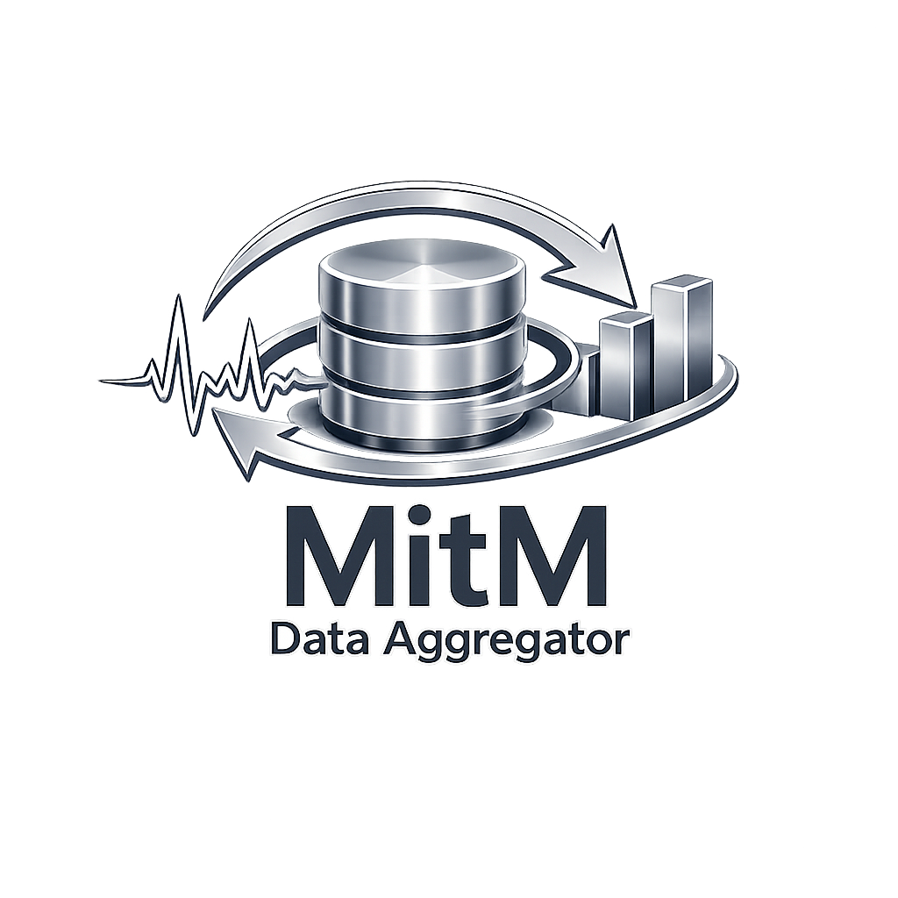
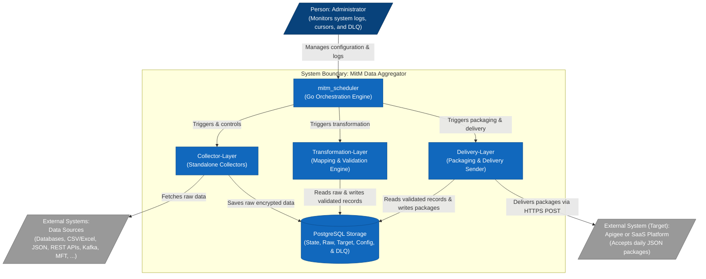

# Man-in-the-Middle (MitM) Data Aggregator

The **MitM Data Aggregator** is a secure, decoupled, and reliable Go-based ingestion and delivery pipeline. It collects raw data from heterogeneous source systems (such as databases, APIs, and CSV files), buffers it locally using Envelope Encryption (AES-GCM), transforms and validates the data, and aggregates it into daily JSON packages for batch delivery to a target SaaS platform.

<div align="center">

</div>

---
<!-- START doctoc generated TOC please keep comment here to allow auto update -->

<details>
<summary>Table of Contents</summary>

- [🏗️ C4 System & Component Context](#-c4-system-component-context)
- [📂 Project Structure & Layers](#-project-structure-layers)
  - [1. [MitM Scheduler](file:///home/zb_bamboo/DEV/__NEW__/Go/mitm-2/scheduler)](#1-mitm-schedulerfilehomezb_bamboodev__new__gomitm-2scheduler)
  - [2. [Collector Layer](file:///home/zb_bamboo/DEV/__NEW__/Go/mitm-2/collector-layer)](#2-collector-layerfilehomezb_bamboodev__new__gomitm-2collector-layer)
  - [3. [Transformation Layer](file:///home/zb_bamboo/DEV/__NEW__/Go/mitm-2/transformation-layer)](#3-transformation-layerfilehomezb_bamboodev__new__gomitm-2transformation-layer)
  - [4. [Delivery Layer](file:///home/zb_bamboo/DEV/__NEW__/Go/mitm-2/delivery-layer)](#4-delivery-layerfilehomezb_bamboodev__new__gomitm-2delivery-layer)
- [🔒 Security & Key Management](#-security-key-management)
- [🛠️ Build and Running Instructions](#-build-and-running-instructions)
  - [1. Prerequisites](#1-prerequisites)
  - [2. Database Migrations](#2-database-migrations)
  - [3. Compiling the Components](#3-compiling-the-components)
  - [4. Running the Pipeline](#4-running-the-pipeline)

</details>

<!-- END doctoc generated TOC please keep comment here to allow auto update -->
---

## 🏗️ C4 System & Component Context

The diagram below shows how the system boundaries are structured and how the components interact with administrators and external systems:



---

## 📂 Project Structure & Layers

The project is structured into separated, decoupled layers:

### 1. [MitM Scheduler](file:///home/zb_bamboo/DEV/__NEW__/Go/mitm-2/scheduler)

- **Location**: [scheduler/README.md](file:///home/zb_bamboo/DEV/__NEW__/Go/mitm-2/scheduler/README.md)
- **Role**: Orchestrates the execution of collectors and delivery jobs on dynamic cron schedules. It receives real-time execution feedback via a Unix domain socket IPC listener.

### 2. [Collector Layer](file:///home/zb_bamboo/DEV/__NEW__/Go/mitm-2/collector-layer)

- **Location**: [collector-layer/README.md](file:///home/zb_bamboo/DEV/__NEW__/Go/mitm-2/collector-layer/README.md)
- **Role**: Autonomous collectors that connect to source systems, fetch raw data, apply initial AES-GCM envelope encryption, and insert them into the `raw_ingestion` landing table.
- **Implementations**:
  *   [mitm_collector_pg-employee/](file:///home/zb_bamboo/DEV/__NEW__/Go/mitm-2/collector-layer/mitm_collector_pg-employee/main.go) - Ingests PostgreSQL employee data using state-based cursors.
  *   [mitm_collector_ora-employee/](file:///home/zb_bamboo/DEV/__NEW__/Go/mitm-2/collector-layer/mitm_collector_ora-employee/main.go) - Ingests Oracle database tables dynamically using a pure-Go driver.

### 3. [Transformation Layer](file:///home/zb_bamboo/DEV/__NEW__/Go/mitm-2/transformation-layer)

- **Location**: [transformation-layer/README.md](file:///home/zb_bamboo/DEV/__NEW__/Go/mitm-2/transformation-layer/README.md)
- **Role**: Reads raw ingested records, decrypts them, applies mapping configurations, dynamic transformations, and validations, and writes target output fields to target tables.

### 4. [Delivery Layer](file:///home/zb_bamboo/DEV/__NEW__/Go/mitm-2/delivery-layer)

- **Location**: [delivery-layer/README.md](file:///home/zb_bamboo/DEV/__NEW__/Go/mitm-2/delivery-layer/README.md)
- **Role**: Aggregates target records into daily JSON batches (`packages`), executes secure delivery with HTTP idempotency key headers, handles transient errors via exponential backoff, and tracks failed messages inside the Dead Letter Queue (DLQ).

---

## 🔒 Security & Key Management

- **Envelope Encryption**: All Personally Identifiable Information (PII) data is encrypted at-rest.
- **Two-Tier Key Hierarchy**:
  - **Master Key (KEK)**: Cryptographically random key injected via the `MASTER_KEY` environment variable. Exists **only in RAM** and is never persisted.
  - **Data Encryption Key (DEK)**: Generated per fragment/source configuration and stored inside the database, encrypted with the KEK.
- **Crypto-Shredding**: By deleting the specific wrapped DEK from `storage_keys`, all data fragments encrypted with that key are instantly and irreversibly destroyed.

---

## 🛠️ Build and Running Instructions

### 1. Prerequisites

- Go 1.25.0 or later.
- PostgreSQL Server.

### 2. Database Migrations

Initialize the tables by running the SQL migration scripts in order:

```bash
# 1. Scheduler Init (job metadata, scheduling, http configuration, admin logs)
psql -h <host> -U <user> -d mitm -f scheduler/mitm_scheduler/migrations/001_init.sql
psql -h <host> -U <user> -d mitm -f scheduler/mitm_scheduler/migrations/002_logging_and_audit.sql
psql -h <host> -U <user> -d mitm -f scheduler/mitm_scheduler/migrations/003_admin_and_api.sql
psql -h <host> -U <user> -d mitm -f scheduler/mitm_scheduler/migrations/004_add_name_unique.sql

# 2. Collector Init (storage keys, source credentials, raw ingestion landing tables, cursors)
psql -h <host> -U <user> -d mitm -f collector-layer/migrations/001_raw_ingestions.sql

# 3. Transformation Init (mapping rules, target schemas, transformations, validations)
psql -h <host> -U <user> -d mitm -f transformation-layer/migrations/001_mapping_source.sql
psql -h <host> -U <user> -d mitm -f transformation-layer/migrations/001_mapping_target_field.sql
psql -h <host> -U <user> -d mitm -f transformation-layer/migrations/001_mapping_transformation.sql
psql -h <host> -U <user> -d mitm -f transformation-layer/migrations/001_mapping_validation.sql
psql -h <host> -U <user> -d mitm -f transformation-layer/migrations/001_mapping_rule.sql

# 4. Delivery Init (JSON packages, DLQ)
psql -h <host> -U <user> -d mitm -f delivery-layer/migrations/001_packages.sql
psql -h <host> -U <user> -d mitm -f delivery-layer/migrations/002_dead_letter_queue.sql
```

### 3. Compiling the Components

To build the scheduler:

```bash
cd scheduler/mitm_scheduler
go build -o ../../bin/scheduler ./cmd/scheduler
go build -o ../../bin/encrypt-config ./cmd/encrypt-config
```

To build the standalone employee collector:

```bash
cd collector-layer/mitm_collector_pg-employee
go build -o ../../bin/mitm-collector-pg-employee main.go
```

### 4. Running the Pipeline

Export the Master Key KEK and start the scheduler with your encrypted configuration:

```bash
export MASTER_KEY="Y29uZmlkZW50aWFsX21hc3Rlcl9rZXlfMzJfYnl0ZXM="
./bin/scheduler /path/to/encrypted_config.json.enc
```
