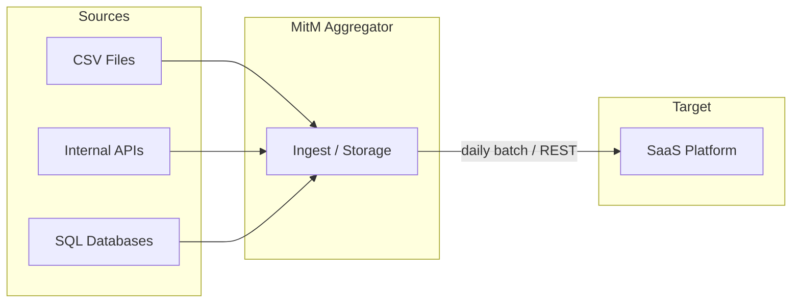
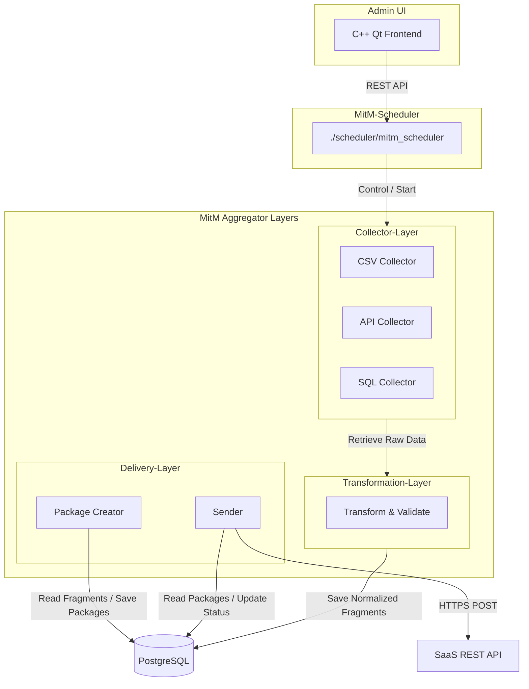
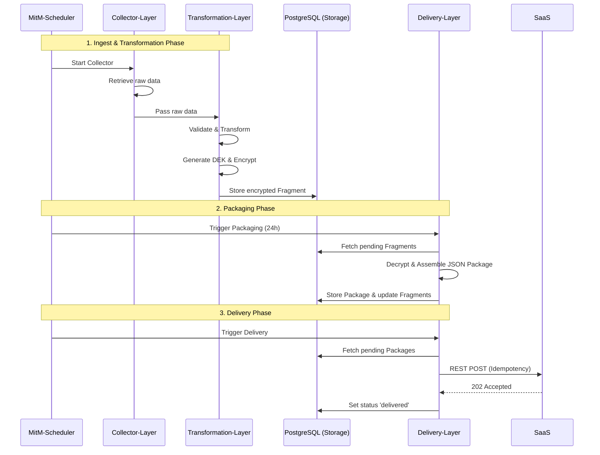
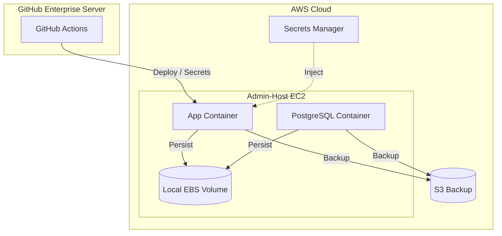
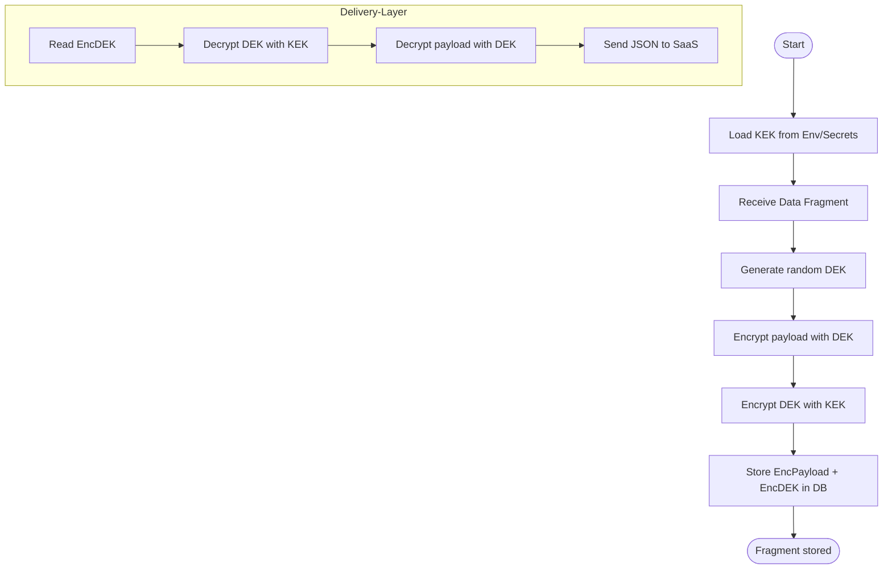

# Architectural Concept: MitM Data Aggregator

## Table of Contents

- [Architectural Concept: MitM Data Aggregator](#architectural-concept-mitm-data-aggregator)
  - [Table of Contents](#table-of-contents)
- [1. Introduction and Goals](#1-introduction-and-goals)
  - [Task Description](#task-description)
  - [Quality Goals](#quality-goals)
  - [Stakeholders](#stakeholders)
- [2. Constraints](#2-constraints)
- [3. Context and Scope](#3-context-and-scope)
  - [Business Context](#business-context)
  - [Technical Context](#technical-context)
- [4. Solution Strategy](#4-solution-strategy)
- [5. Building Block View](#5-building-block-view)
  - [Whitebox Overall System](#whitebox-overall-system)
    - [MitM-Scheduler (Control)](#mitm-scheduler-control)
    - [Collector-Layer](#collector-layer)
    - [Transformation-Layer](#transformation-layer)
    - [Delivery-Layer](#delivery-layer)
    - [State \& Storage](#state--storage)
- [6. Runtime View](#6-runtime-view)
  - [Daily Workflow](#daily-workflow)
- [7. Deployment View](#7-deployment-view)
  - [Infrastructure Level 1](#infrastructure-level-1)
- [8. Cross-Cutting Concepts](#8-cross-cutting-concepts)
  - [Security \& Key Management](#security--key-management)
  - [Monitoring \& Diagnostics](#monitoring--diagnostics)
- [9. Architectural Decisions](#9-architectural-decisions)
- [10. Quality Requirements](#10-quality-requirements)
- [11. Risks and Technical Debt](#11-risks-and-technical-debt)
- [12. Artifacts](#12-artifacts)
  - [Security Flow Diagram](#security-flow-diagram)
- [13. Glossary](#13-glossary)

# 1. Introduction and Goals

## Task Description

Provision of a reliable, secure, and decoupled system (Man-in-the-Middle Aggregator) that collects data from various source systems (left), buffers it locally, aggregates it daily into JSON packages, and transmits it via REST to a target SaaS (right).

**Core Features:**

- Decoupling of sources and target.
- Daily packaged transmission.
- Full use of open-source components (MIT, Apache 2.0).
- Secure storage of personally identifiable information (PII) using Envelope Encryption.

## Quality Goals

| Goal | Description |
| :--- | :--- |
| **Security (Data Privacy)** | Protection of PII data "at-rest" using AES-GCM Envelope Encryption (KEK/DEK). |
| **Resilience** | Fault tolerance against failures of the SaaS or source systems using retries and cursors. |
| **Maintainability** | Modular design (Adapter pattern) for easy integration of new sources. |
| **Traceability** | Complete audit logging of security-relevant and process events. |

## Stakeholders

| Role | Expectation |
| :--- | :--- |
| **IT Architect** | Clean technological separation, compliance with security standards. |
| **Security Officer** | Encryption of PII data, secure key handling (MasterKey is not persistent). |
| **Operations Team (Admins)** | Simple deployment (containers), clear monitoring (Prometheus), logging (JSON). |
| **SaaS Provider** | Compliance with rate limits, correct JSON structures, idempotency. |

# 2. Constraints

- **Technology:** Go (Golang) as the primary language for performance and single-binary deployment.
- **Data Storage:** PostgreSQL for state management and fragments (robust concurrency and scalability).
- **Platform:** AWS EC2 (Admin Host) with Docker, GitHub Enterprise Server (GHES) for CI/CD.
- **Licenses:** Open source only (MIT, Apache 2.0, etc.). No proprietary libraries.

# 3. Context and Scope

## Business Context

The system sits between any number of source systems (e.g., CSV exports, internal APIs) and a central SaaS platform. It acts as a buffer and aggregator.

## Technical Context

- **Source Interfaces:** Collector interface (polling/push) for CSV, REST, SQL, Kafka, MFT, etc., implemented in the Collector-Layer.
- **Target Interfaces:** REST API (HTTPS) of the SaaS including bearer tokens and idempotency headers.
- **Key Management:** Injection of the Master Key via environment (GHES Secrets / AWS Secrets Manager).

# 4. Solution Strategy

- **Collector-Layer:** Encapsulation of source-specific collectors for easy extensibility.
- **Asynchronous Processing:** Separation of collection (Collector-Layer), transformation and validation (Transformation-Layer), and packaging and delivery (Delivery-Layer).
- **Envelope Encryption:** Each fragment is encrypted with an individual DEK; DEKs are stored encrypted with a KEK (MasterKey).
- **Stateful Polling:** Use of cursors to load only new data since the last run.

# 5. Building Block View

## Whitebox Overall System

The system consists of three main architectural layers controlled by a central scheduler, alongside a central storage layer:

### MitM-Scheduler (Control)

Located in [mitm_scheduler](file:///home/zb_bamboo/DEV/__NEW__/Go/mitm-2/scheduler/mitm_scheduler). Responsible for starting and orchestrating the collectors in the Collector-Layer, as well as exposing the REST API for the Admin Frontend.

### Admin Frontend (UI)

Located in [admin-frontend](file:///home/zb_bamboo/DEV/__NEW__/Go/mitm-2/admin-frontend/mitm_fe_cpp). A native C++ Qt application that serves as the visual control plane. It allows administrators to configure transformation mappings (including Auto-Map), schedule jobs, and monitor system/audit logs via secure REST APIs.

### Collector-Layer

Consists of multiple collectors (Kollektoren) that utilize different data sources (e.g. CSV files, internal APIs, SQL databases) (documented in [collector-layer](file:///home/zb_bamboo/DEV/__NEW__/Go/mitm-2/collector-layer)).

### Transformation-Layer

Located in [transformation-layer](file:///home/zb_bamboo/DEV/__NEW__/Go/mitm-2/transformation-layer). Responsible for transforming and validating the fragments collected from source systems before they are securely persisted in the database.

### Delivery-Layer

Located in [delivery-layer](file:///home/zb_bamboo/DEV/__NEW__/Go/mitm-2/delivery-layer). Responsible for creating packages from the individual fragments and sending them. It reads pending fragments, creates packages according to target specifications, and delivers them to the SaaS target platform.

### State & Storage

PostgreSQL database. Manages cursors (progress), fragments (buffer), and packages (ready for delivery).

# 6. Runtime View

## Daily Workflow

# 7. Deployment View

## Infrastructure Level 1

# 8. Cross-Cutting Concepts

## Security & Key Management

- **Envelope Encryption:** KEK (MasterKey) resides only in RAM. DEKs are stored encrypted in the DB.
- **TLS:** HTTPS for all external calls.
- **Least Privilege:** Container runs as a non-root user with restricted filesystem permissions.

## Monitoring & Diagnostics

- **Logging:** Structured JSON logging via `zerolog` (stdout for Docker log drivers).
- **Metrics:** Prometheus exporter for fragment counters, package sizes, and API latencies.
- **Audit Log:** Immutable table in PostgreSQL for critical actions (admin access, key rotation).

# 9. Architectural Decisions

- **PostgreSQL instead of SQLite:** Chosen to support high-concurrency environments, robust connection management, and better scalability, while ensuring transactional safety and reliability.
- **Go instead of Python:** Type safety for complex transformations and easy deployment as a static binary.
- **Stateless App / Stateful Storage:** The app itself can be restarted at any time; the entire state resides in the PostgreSQL database.

# 10. Quality Requirements

- **PII Protection:** 100% of personally identifiable information must be persisted in encrypted form.
- **Data Loss Prevention:** Cursors prevent double ingestion or skipping of records.

# 11. Risks and Technical Debt

- **Database Size:** At extremely high volumes, an archiving or partitioning strategy for old fragments must be implemented.
- **Key Loss:** Loss of the Master Key results in total data loss in the database (Mitigation: Backup of the key in a secure Vault).

# 12. Artifacts

## Security Flow Diagram

# 13. Glossary

| Term | Definition |
| :--- | :--- |
| **Fragment** | Smallest unit of data from a source (e.g., a row of a CSV). |
| **Package** | Aggregation of multiple fragments into a JSON document for SaaS delivery. |
| **KEK** | Key Encryption Key (Master Key). |
| **DEK** | Data Encryption Key (per fragment). |
| **DLQ** | Dead Letter Queue (storage for permanently failed records). |
