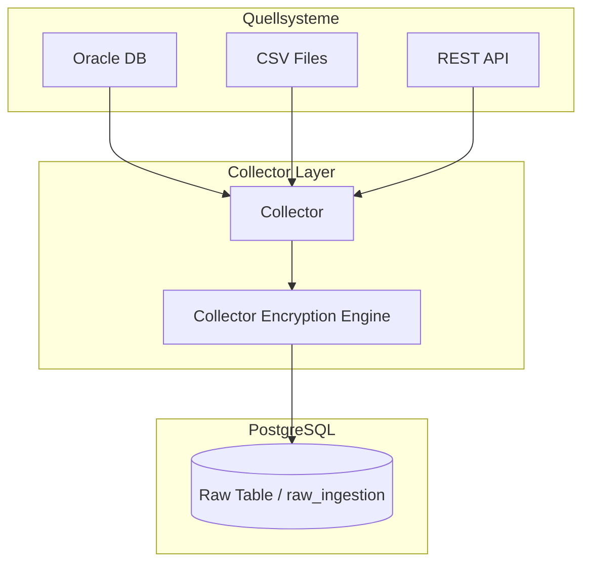

# Collector Layer Documentation

The **Collector Layer** is responsible for retrieving raw data from various source systems, applying initial encryption, and storing it safely in the database.

---

## 🏗️ Architecture & Ingestion System

The Collector Layer acts as a decoupled data acquisition component:

### Components

1.  **Collectors**: Independent processes specialized in querying/fetching data from heterogeneous source systems (CSV, REST APIs, SQL databases).
2.  **Encryption Engine**: Encrypts sensitive fields or the entire raw payload using AES-GCM envelope encryption before writing it to database storage.
3.  **Raw Ingestion Storage**: The central entry database table (`raw_ingestion`) where the encrypted data is buffered before transformation.

---

## 🔄 Workflow

For a detailed explanation of the encryption models, schemas, and configurations, refer to the [collector_concept.md](file:///home/zb_bamboo/DEV/__NEW__/Go/mitm-2/collector-layer/collector_concept.md).

### Standard Sequence

1.  **Start/Trigger**: Initiated and controlled by the [MitM-Scheduler](file:///home/zb_bamboo/DEV/__NEW__/Go/mitm-2/scheduler/mitm_scheduler).
2.  **Credentials Decryption**: The collector retrieves its connection configuration from `source_credentials`, decrypted on the fly using the Master Key (KEK) and the stored Data Encryption Key (DEK).
3.  **Data Fetching**: The collector connects to the source system and queries new/updated records.
4.  **Envelope Encryption**: For each fragment, a DEK is generated/loaded, the fragment payload is encrypted via AES-GCM, and both the encrypted payload and the encrypted DEK are stored in `raw_ingestion`.
5.  **Status**: The record status is marked as `pending` to signal to the Transformation Layer that it is ready for processing.

---

## 📦 Implementations

*   **[mitm_collector_pg-employee](file:///home/zb_bamboo/DEV/__NEW__/Go/mitm-2/collector-layer/mitm_collector_pg-employee/main.go)**: A standalone Go collector that retrieves employee records from a source PostgreSQL database. It fetches connection details from `source_credentials`, decrypts them using AES-GCM envelope encryption (KEK/DEK), queries the source database using incremental cursor offsets, and stores the encrypted data fragments in `raw_ingestion`.
*   **[mitm_collector_ora-employee](file:///home/zb_bamboo/DEV/__NEW__/Go/mitm-2/collector-layer/mitm_collector_ora-employee/main.go)**: A standalone Go collector that dynamically retrieves data records from an Oracle database table using the `go-ora` driver. It decrypts source connection details from `source_credentials` via KEK/DEK envelope encryption, queries new entries using dynamic scan values and cursor limits, and writes the encrypted JSON fragments to the `raw_ingestion` table.

