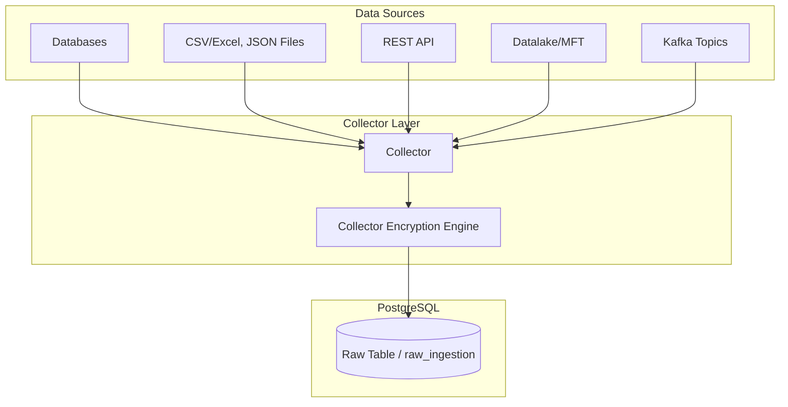

# Collector Layer Documentation

The **Collector Layer** is responsible for retrieving raw data from various source systems, applying initial encryption, and storing it safely in the database.

---

## 🏗️ Architecture & Ingestion System

The Collector Layer acts as a decoupled data acquisition component:

```mermaid
flowchart TD
    subgraph SourceSystems[Data Sources]
        ORA[Databases]
        CSV[CSV/Excel, JSON Files]
        API[REST API]
        MFT[Datalake/MFT]
        KAFKA[Kafka Topics]
    end

    subgraph CollectorLayer[Collector Layer]
        C[Collector] --> ENC1[Collector Encryption Engine]
    end

    subgraph DB[PostgreSQL]
        RAW[(Raw Table / raw_ingestion)]
    end

    ORA --> C
    CSV --> C
    API --> C
    MFT --> C
    KAFKA --> C
    ENC1 --> RAW
```

### Components

1.  **Collectors**: Independent processes specialized in querying/fetching data from heterogeneous source systems (CSV, REST APIs, SQL databases, Kafka).
2.  **Encryption Engine**: Encrypts sensitive fields or the entire raw payload using AES-GCM envelope encryption before writing it to database storage.
3.  **Raw Ingestion Storage**: The central entry database table (`raw_ingestion`) where the encrypted data is buffered before transformation.

### Key Architectural Principles

- **Atomicity & Batching**: All data inserts and cursor updates are batched (`pgx.Batch`) and executed in a single transaction to ensure "Exactly-Once" or idempotency without skipping.
- **Graceful Shutdown**: Collectors intercept `SIGINT`/`SIGTERM` via context cancellation to flush active batches safely before exiting.
- **Robust Error Handling & IPC**: Any serialization or encryption failure is counted as `recordsFailed` and reported to the Scheduler via Unix Domain Sockets at the end of the run, avoiding silent data loss.

---

## 🔄 Workflow

For a detailed explanation of the encryption models, schemas, and configurations, refer to the [collector_concept.md](collector_concept.md).

### Standard Sequence

1.  **Start/Trigger**: Initiated and controlled by the [MitM-Scheduler](../scheduler/mitm_scheduler).
2.  **Credentials Decryption**: The collector retrieves its connection configuration from `source_credentials`, decrypted on the fly using the Master Key (KEK) and the stored Data Encryption Key (DEK).
3.  **Data Fetching**: The collector connects to the source system and queries new/updated records.
4.  **Envelope Encryption**: For each fragment, a DEK is generated/loaded, the fragment payload is encrypted via AES-GCM, and both the encrypted payload and the encrypted DEK are stored in `raw_ingestion`.
5.  **Status**: The record status is marked as `pending` to signal to the Transformation Layer that it is ready for processing.

---

## 📦 Implementations

- **mitm_collector_pg**: A standalone Go collector that retrieves records from a source PostgreSQL database. It fetches connection details from `source_credentials`, queries using incremental cursor offsets, and stores encrypted data fragments in `raw_ingestion`.
- **mitm_collector_ora**: A standalone Go collector that retrieves data records from an Oracle database table using the `go-ora` driver.
- **mitm_collector_csv-xls**: A standalone Go collector that retrieves data from a uploaded CSV or Excel file.
- **mitm_collector_kafka**: A standalone Go collector that connects to Apache Kafka topics and processes streaming data into the aggregator.
