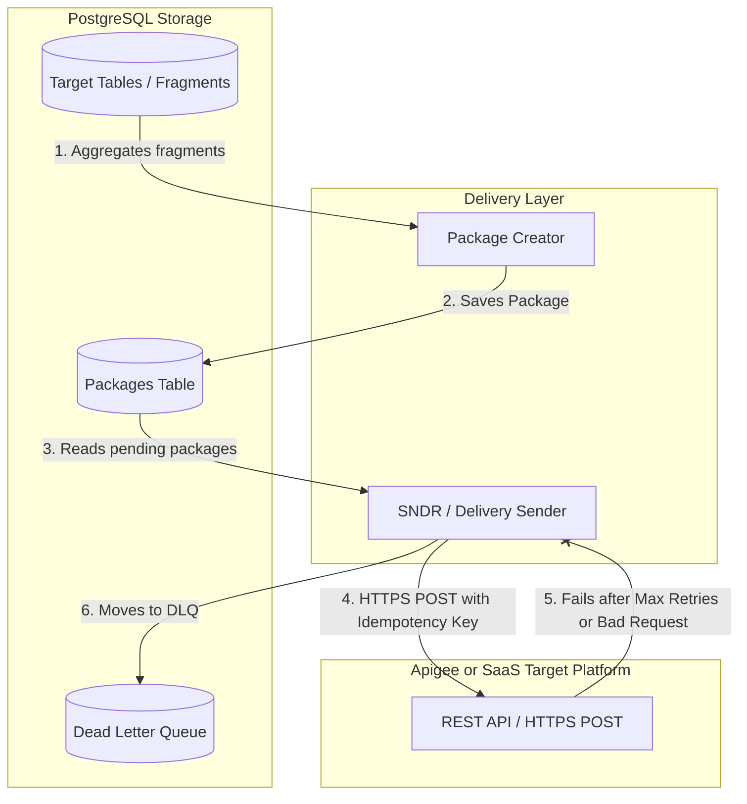

# Delivery Layer Documentation

The **Delivery Layer** is responsible for aggregating transformed data fragments into JSON packages, saving them for audit/retry purposes, and transmitting them securely to the target SaaS platform.

**[Repo](https://github.com/Zheng-Bote/mitm_delivery)**

---

## 🏗️ Architecture

The Delivery Layer acts as the final stage of the MitM-Aggregator pipeline:

### Components

1.  **Package Creator (Packager)**: Aggregates processed/transformed data fragments into larger JSON payloads according to target SaaS schemas, generating a unique `idempotency_key` for each batch.
2.  **Delivery Sender (Sender)**: Fetches pending packages and posts them to the SaaS target REST endpoint.
3.  **Idempotency & Retry Engine**: Manages HTTP retry policies (exponential backoff) and guarantees once-and-only-once delivery using HTTP idempotency headers.

---

## 🔄 Delivery Workflow

### 1. Packaging Phase

- Triggered periodically (e.g. every 24h) by the [MitM-Scheduler](file:///home/zb_bamboo/DEV/__NEW__/Go/mitm-2/scheduler/mitm_scheduler).
- Retrieves target fragments with `pending` delivery status.
- Packs these fragments into JSON documents, assigns a unique `idempotency_key`, and saves them to the `packages` table.

### 2. Transmission Phase

- The Sender polls the `packages` table for items with a status of `pending`.
- Issues an `HTTPS POST` to the SaaS API, passing the payload and the `idempotency_key` in the headers.
- **Success (2xx / 202 Accepted)**: Sets status to `delivered` and records the timestamp.
- **Temporary Errors (429 Too Many Requests, 503 Service Unavailable)**: Retries with exponential backoff (e.g., using `go-retryablehttp`).
- **Permanent Errors (400 Bad Request, 401 Unauthorized) or Max Retries Exceeded**: Moves the package to the Dead Letter Queue (DLQ).

### 3. DLQ & Replay

- Undeliverable packages are stored in the `dead_letter_queue` table.
- Administrators can investigate the errors, fix schema drifts, and re-queue/replay resolved DLQ packages.

---

## 💾 Database Schema (Migrations)

The tables for the Delivery Layer are defined in the following migration files:

- [001_packages.sql](file:///home/zb_bamboo/DEV/__NEW__/Go/mitm-2/delivery-layer/migrations/001_packages.sql) - Schema for storing assembled daily packages and tracking their delivery state.
- [002_dead_letter_queue.sql](file:///home/zb_bamboo/DEV/__NEW__/Go/mitm-2/delivery-layer/migrations/002_dead_letter_queue.sql) - Schema for storing failed packages for audit, troubleshooting, and manual replay.
