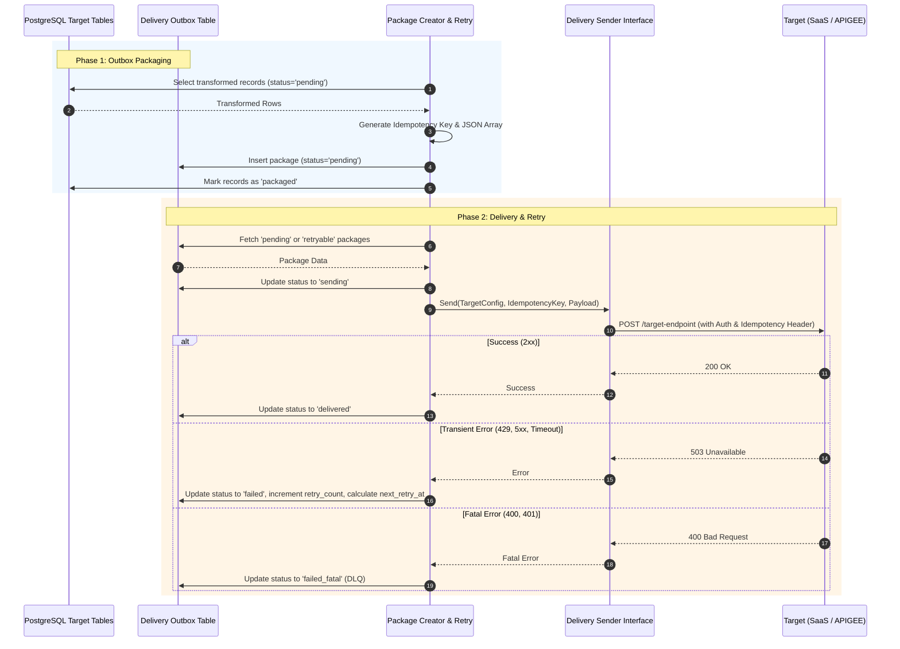

# Delivery Layer Concept

The **Delivery Layer** is the final stage of the MitM (Man-in-the-Middle) Data Aggregator pipeline. Its primary responsibility is to securely and reliably transmit the transformed and encrypted records from the local PostgreSQL database to external target systems.

To ensure resilience, scalability, and future-proofing, the Delivery Layer is strictly decoupled into two distinct components:

1. **Package Creator (Packager) & Retry Engine**
2. **Delivery Sender (Interchangeable Adapter)**

---

## 🏗️ 1. Package Creator (Packager) & Retry Engine

This component is responsible for data assembly, state management, and orchestrating robust network interactions. It operates independently of the actual network transmission logic.

### Package Creator (Packager)
Instead of streaming individual records out as soon as they are transformed, the Packager fetches pending records from the target tables and groups them into logical "Delivery Packages" (e.g., JSON arrays).

- **Batching & Aggregation:** Reads records where `delivery_status = 'pending'`, groups them by destination or topic, and constructs a standardized Delivery Envelope.
- **Outbox Pattern:** The assembled JSON package is persisted into a central `delivery_outbox` table. This decouples the transformation phase from the network latency of the delivery phase.
- **Idempotency Key Generation:** Generates a unique `Idempotency-Key` (e.g., a v4 UUID) for every package. This guarantees that if a network timeout occurs, re-sending the exact same package will not result in duplicated data at the target.

### Idempotency & Retry Engine
Networks are inherently unreliable. The Retry Engine monitors the `delivery_outbox` for failed or timed-out packages.

- **State Machine:** Packages transition through states: `pending` -> `sending` -> `delivered` / `failed`.
- **Exponential Backoff:** If the target system returns a transient error (e.g., `429 Too Many Requests` or `503 Service Unavailable`), the engine schedules a retry with exponentially increasing delays (e.g., 2s, 4s, 8s, 16s).
- **Dead Letter Queue (DLQ):** If a package continuously fails (e.g., `400 Bad Request` or maximum retries exceeded), it is marked as `failed_fatal` and requires manual intervention.

---

## 🔌 2. Delivery Sender (Interchangeable)

Because target systems may evolve (e.g., migrating from a direct SaaS API endpoint to an internal APIGEE API Gateway), the component actually performing the HTTP(S) transmission must be strictly interchangeable.

The **Delivery Sender** implements a generic interface (Strategy Pattern). The Orchestrator reads the routing configuration and instantiates the correct sender adapter at runtime based on the destination.

### The Sender Interface (Go Concept)
```go
type DeliverySender interface {
    // Send transmits the payload and returns an HTTP status code or an error
    Send(ctx context.Context, targetConfig TargetConfig, idempotencyKey string, payload []byte) (statusCode int, err error)
}
```

### Supported / Planned Adapters

#### A. Target 1: Direct SaaS Adapter
- **Authentication:** OAuth2 Client Credentials flow or static API Key.
- **Headers:** Custom SaaS-specific headers.
- **Endpoint:** `https://api.saas-vendor.com/v1/ingest`

#### B. Target 2: APIGEE API Gateway Adapter
- **Authentication:** Mutual TLS (mTLS) with client certificates + JWT.
- **Headers:** X-Apigee-Routing and Gateway rules.
- **Endpoint:** `https://gateway.internal.corp/mitm/v1/deliver`

---

## 🔄 Architecture Flow



## 🛠 Database Schema Concept (Delivery)

The Delivery Layer relies on the pre-defined PostgreSQL schemas located in `./migrations/`.

### 1. The `packages` Table (Outbox)
Stores assembled JSON packages, tracking their lifecycle and retry metrics.

```sql
CREATE TABLE IF NOT EXISTS packages (
    id               UUID PRIMARY KEY DEFAULT gen_random_uuid(),
    payload          JSONB NOT NULL,                 -- Aggregated data package ready to be sent
    status           VARCHAR(50) DEFAULT 'pending',  -- 'pending', 'sending', 'delivered', 'failed'
    retry_count      INT DEFAULT 0,
    idempotency_key  UUID NOT NULL UNIQUE,           -- To ensure SaaS idempotency
    error_message    TEXT,                           -- Error description in case of failure
    created_at       TIMESTAMPTZ DEFAULT NOW(),
    delivered_at     TIMESTAMPTZ
);
```

### 2. The `dead_letter_queue` Table (DLQ)
Stores permanently failed packages (`failed_fatal` equivalent) to prevent queue blocking and allow manual troubleshooting or later replay.

```sql
CREATE TABLE IF NOT EXISTS dead_letter_queue (
    id               UUID PRIMARY KEY DEFAULT gen_random_uuid(),
    package_id       UUID REFERENCES packages(id) ON DELETE SET NULL,
    payload          JSONB NOT NULL,                 -- Copy of the failed package/data payload
    error_code       VARCHAR(50),                    -- E.g., 'HTTP_400', 'TRANSFORMATION_ERROR'
    error_message    TEXT,                           -- Details of why it was moved to DLQ
    failed_at        TIMESTAMPTZ DEFAULT NOW(),
    resolved         BOOLEAN DEFAULT FALSE,
    resolved_at      TIMESTAMPTZ
);
```

### Implementation Detail: Dynamic Targeting
Since the `packages` table is agnostic of the destination, the target endpoint (SaaS vs APIGEE) and credentials are provided to the Delivery CLI batch job at runtime via the `mitm_scheduler` JSON configuration `os.Args[1]`. The MitM Database credentials themselves are injected globally via Environment Variables (`MITM_DB_*`). The Orchestrator uses this config to dynamically bind the correct `DeliverySender` adapter.

### Future Enhancements
- **Concurrency:** The Retry Engine can spawn multiple goroutines to drain the `packages` table in parallel (using `FOR UPDATE SKIP LOCKED`).
- **Target Rate Limiting:** The Sender implementation can respect HTTP `Retry-After` headers and enforce internal limits to prevent overwhelming the target.
