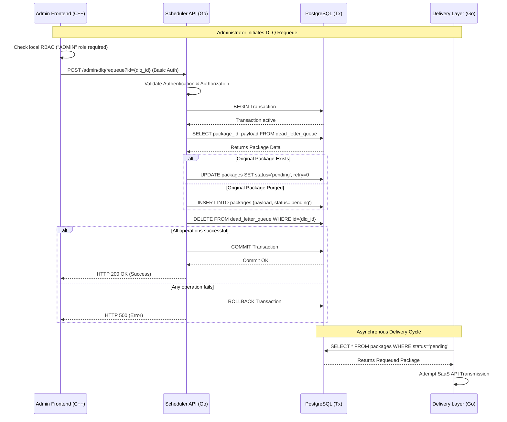

# Dead Letter Queue (DLQ) Requeue Flow

The Dead Letter Queue (DLQ) mechanism acts as a safety net for target payloads that permanently fail to be delivered to the SaaS REST API after exhausting their exponential backoff retry cycles.

This document describes the architectural flow and transactional sequence when an Administrator initiates a **"Requeue Selected"** action from the C++ Frontend UI to inject a failed payload back into the regular delivery pipeline.

## Architectural Flow

The requeue process safely spans across three architectural boundaries: the **UI (Admin Frontend)**, the **API & Orchestrator (Scheduler)**, and the **Asynchronous Workers (Delivery Layer)**.

1. **Frontend Authorization & Request**
   The C++ Frontend performs a local Role-Based Access Control (RBAC) check. Only users with the `ADMIN` role are permitted to trigger a requeue. The frontend then issues an authenticated `POST /admin/dlq/requeue?id=<UUID>` HTTP request to the Scheduler component.

2. **Backend API Authentication**
   The Scheduler receives the HTTP request and enforces Basic Authentication. It verifies the credentials against the internal OS users database before proceeding.

3. **Atomic Database Transaction (The Core)**
   To ensure absolute data consistency (preventing both data loss and payload duplication), the Scheduler orchestrates a strict PostgreSQL transaction (`pgx.Tx`):
   - **Fetch:** Extracts the old `package_id` and the encrypted JSON `payload` from the `dead_letter_queue` table.
   - **Scenario A (Package Exists):** If the original package record is still present in the database, the Scheduler issues an `UPDATE` on the `packages` table. It resets the `status` to `'pending'`, `retry_count` to `0`, sets `next_retry_at` to the current timestamp (`NOW()`), and clears any residual `error_message`.
   - **Scenario B (Package Purged):** If the original package record was deleted by routine cleanup tasks, the Scheduler recovers the JSON payload directly from the DLQ entry. It then issues an `INSERT INTO packages` to synthesize a brand-new package with a newly generated `idempotency_key` and a `'pending'` status.
   - **Cleanup:** The processed entry is permanently deleted from the `dead_letter_queue` table.
   - **Commit/Rollback:** The transaction is committed. If any step fails (e.g., database constraint error), a rollback guarantees the payload safely remains in the DLQ.

4. **Resumption by Delivery Layer**
   Because the package now resides in the `packages` table with a `'pending'` status, it becomes a valid candidate for the Delivery Layer workers. During the next cron execution, the `mitm_delivery` component seamlessly picks up the package and resumes the standard SaaS REST API transmission lifecycle (including fresh retry constraints).

## Sequence Diagram

