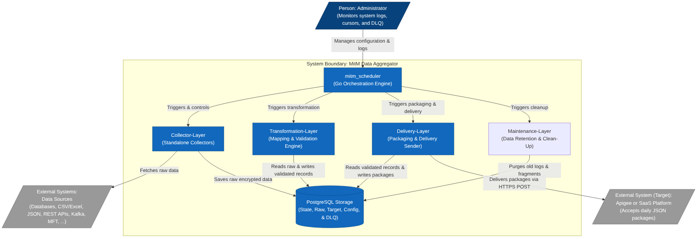

# MitM Data Aggregator — Management Overview

> **A comprehensive, multi-layer data ingestion and delivery pipeline.**
> Built in Go. Backed by PostgreSQL. Secured by Envelope Encryption.

## Project Overview

The **MitM (Man-in-the-Middle) Data Aggregator** project is a secure and decoupled data ingestion and delivery pipeline written primarily in Go (Golang). The system collects raw data from heterogeneous source systems (e.g., PostgreSQL, Oracle, CSV, APIs), encrypts it locally ("at-rest"), validates and transforms it, and finally sends it as aggregated JSON batches to a target SaaS platform (e.g., Apigee).

The project places high value on data security and the protection of personally identifiable information (PII) through the use of **Envelope Encryption** (AES-GCM with a two-tier key hierarchy: KEK and DEK) as well as crypto-shredding. PostgreSQL is used for data storage, buffering, and state management (e.g., cursors, dead letter queue).

---

## Table of Contents

1. [System-at-a-Glance](#1-system-at-a-glance)
2. [Root Project (Repository Root)](#2-root-project-repository-root)
3. [MitM Scheduler](#3-mitm-scheduler)
4. [Collector Layer](#4-collector-layer)
5. [Transformation Layer](#5-transformation-layer)
6. [Delivery Layer](#6-delivery-layer)
7. [Maintenance Layer](#7-maintenance-layer)
8. [Admin Frontend](#8-admin-frontend)
9. [Security Architecture (Cross-Cutting)](#9-security-architecture-cross-cutting)
10. [Operational Summary](#10-operational-summary)

---

## 1. System-at-a-Glance

| Attribute              | Description                                                                                                                                                                                                                                                        |
| :--------------------- | :----------------------------------------------------------------------------------------------------------------------------------------------------------------------------------------------------------------------------------------------------------------- |
| **Purpose**            | Collect data from heterogeneous source systems (SQL databases, CSV files, Kafka streams, Oracle), buffer it locally with full PII encryption, transform and validate it into Golden Records, and deliver it as aggregated JSON packages to a target SaaS platform. |
| **Architecture Style** | Modular, decoupled pipeline with a central scheduler. Each layer is a standalone Go binary orchestrated via cron schedules.                                                                                                                                        |
| **Primary Language**   | Go (Golang) — static binaries, type-safe, performant.                                                                                                                                                                                                              |
| **Data Storage**       | PostgreSQL — state management, cursor tracking, encrypted fragments, packages, audit logs, and Dead Letter Queue.                                                                                                                                                  |
| **Encryption**         | AES-256-GCM Envelope Encryption (KEK/DEK two-tier hierarchy). Master Key exists only in RAM.                                                                                                                                                                       |
| **Delivery Pattern**   | Daily batch JSON packages via HTTPS POST with idempotency keys and exponential backoff.                                                                                                                                                                            |
| **License**            | Apache 2.0 / MIT — fully open-source, no proprietary dependencies.                                                                                                                                                                                                 |
| **Deployment**         | Docker containers on AWS EC2, CI/CD via GitHub Enterprise Server.                                                                                                                                                                                                  |

### Layer Overview

| Layer                    | Role                                                                                      | Key Binary                                                                                  |
| :----------------------- | :---------------------------------------------------------------------------------------- | :------------------------------------------------------------------------------------------ |
| **Scheduler**            | Orchestrates all jobs via cron, exposes REST API for admin                                | `mitm-server`                                                                               |
| **Collector Layer**      | Ingests raw data from sources, encrypts, writes to `raw_ingestion`                        | `mitm-collector-pg`, `mitm-collector-ora`, `mitm-collector-csv-xls`, `mitm-collector-kafka` |
| **Transformation Layer** | Decrypts, merges (Stateful Aggregation), transforms, validates, encrypts sensitive fields | `mitm-transformer`                                                                          |
| **Delivery Layer**       | Aggregates into JSON packages, delivers via HTTPS, retries, DLQ                           | `mitm-deliver`                                                                              |
| **Maintenance Layer**    | Purges expired records per retention policy (GDPR)                                        | `mitm-cleanup`                                                                              |
| **Admin Frontend**       | Desktop GUI for configuration, monitoring, DLQ management                                 | `mitm_fe_cpp` (C++/Qt) or Go/Fyne                                                           |



---

## 2. Root Project (Repository Root)

**Key files:** `README.md`, `architecture.md`, `concept_mitm_aggregator.md`, `CHANGELOG.md`, `LICENSE`, `glossary.md`

The root `README.md` provides the project-level entry point. It describes:

- **Core mission:** A secure, decoupled Go-based pipeline that sits "in the middle" between source systems and a target SaaS platform.
- **Six architectural layers** (Scheduler, Collector, Transformation, Delivery, Maintenance, Admin Frontend).
- **Security posture:** Envelope Encryption with a two-tier key hierarchy (KEK in RAM + DEK per fragment in the database). Crypto-shredding is supported by deleting the wrapped DEK.
- **Build & run instructions:** Database migrations for all layers are listed in order; end-to-end test script (`test_e2e.sh`) verifies the full chain.
- **Technologies:** Go 1.26+, PostgreSQL, Docker, Prometheus metrics, JSON structured logging.

The separate `architecture.md` (arc42-style) covers:

- **Quality goals:** Security (PII protection at rest), resilience (retries, cursors), maintainability (adapter pattern), traceability (audit logs).
- **Building block view:** Whitebox diagram of Scheduler -> Collector -> Transformation -> Delivery -> PostgreSQL flow.
- **Runtime view:** Three-phase daily workflow — (1) Ingest & Transform, (2) Packaging, (3) Delivery.
- **Deployment view:** AWS EC2 Admin Host running Docker containers, with PostgreSQL container, EBS volumes, and S3 backups. CI/CD via GHES Actions.
- **Cross-cutting:** Envelope encryption, TLS, Prometheus metrics, immutable audit logs.
- **Risks:** Database size at scale (partitioning needed), Master Key loss (mitigated by Vault backup).

The `concept_mitm_aggregator.md` is the original concept paper, covering: bounded contexts, interfaces, MVP roadmap (6 sprints), and a detailed security flow diagram for the Envelope Encryption lifecycle.

---

## 3. MitM Scheduler

**Location:** `scheduler/mitm_scheduler/`
**Binary:** `mitm-server`
**Repository:** [github.com/Zheng-Bote/mitm_scheduler](https://github.com/Zheng-Bote/mitm_scheduler)

### Role

The Scheduler is the **control plane** of the entire system. It is a Linux command-line scheduler daemon that:

- Reads job definitions (cron expressions, commands, arguments) from a PostgreSQL database.
- Executes external Go binaries (collectors, transformers, deliverers, cleanup) on schedule.
- Exposes a **REST API** for remote administration (create/update/delete jobs, tail logs).
- Supports **IPC over Unix Domain Sockets** — child jobs report status and audit events back to the scheduler in real time.
- Stores encrypted configuration (`config.json.enc`) using AES-256-GCM + Argon2id.

### Key Features

| Feature                      | Detail                                                                                           |
| :--------------------------- | :----------------------------------------------------------------------------------------------- |
| **Cron scheduling**          | Standard 5-field cron expressions, dynamic reload without restart                                |
| **Encrypted config**         | DB credentials + admin tokens stored in AES-256-GCM encrypted JSON file                          |
| **Admin API**                | Remote job management with authentication (username/token), automatic `next_run` calculation     |
| **Enhanced logging**         | Four log tables: `system_logs`, `job_status_events`, `job_audit_logs`, `admin_audit_logs`        |
| **Health endpoints**         | `/health`, `/info`, `/time`                                                                      |
| **Docker support**           | Dockerfile provided, runs with `SCHEDULER_PASSWORD` env var                                      |
| **Cross-platform admin GUI** | Fyne-based desktop app in `cmd/scheduler-admin` (Linux + Windows, with Windows Hello biometrics) |

### Injected Environment Variables

When the scheduler launches a job, it securely injects:

- `RUN_ID`, `SCHEDULER_SOCKET_PATH` — for IPC lifecycle tracking.
- `MITM_DB_CONFIG_JSON` (or individual `MITM_DB_*` vars) — database connection for the child process.
- `MASTER_KEY` — the KEK for Envelope Encryption, passed through from the scheduler environment.

### Documentation

The `docs/` directory within the scheduler project contains:

- **Architecture Overview** — system context and container design (C4 model).
- **Database Schema** — ER diagrams for scheduling tables.
- **Data Flow & Sequence** — sequence diagrams for process execution and admin reloads.
- **REST API Reference** — complete endpoint list with query parameters and payload examples.
- **Scheduler Admin GUI** — build guide, UI layout, Windows Hello biometric flow.

---

## 4. Collector Layer

**Location:** `collector-layer/`
**Binaries:** `mitm-collector-pg`, `mitm-collector-ora`, `mitm-collector-csv-xls`, `mitm-collector-kafka`

### Role

The Collector Layer is the **data acquisition front-end**. Each collector is a standalone Go binary specialized for one source system type. Collectors:

1. Pull raw data from source systems (PostgreSQL, Oracle, CSV/Excel files, Kafka streams).
2. Encrypt all PII data before it touches disk (Envelope Encryption via AES-256-GCM).
3. Write encrypted fragments to the `raw_ingestion` table as `pending` records.
4. Report real-time progress and audit events back to the scheduler via Unix Domain Socket IPC.
5. Maintain **cursors** (`ingestion_cursors`) for incremental / stateful data extraction.

### Collector Implementations

#### PostgreSQL Collector (`mitm_collector_pg`)

- **Source:** External PostgreSQL database.
- **Driver:** `pgx/v5`.
- **Ingestion strategy:** Cursor-based incremental read using `id > lastCursor`.
- **Key feature:** Generates deterministic `correlation_id` (UUIDv5) from a configurable `business_key_column` — critical for joining data from multiple sources in the Transformation Layer.

#### Oracle Collector (`mitm_collector_ora`)

- **Source:** Oracle database.
- **Driver:** `sijms/go-ora/v2` (pure Go, no Oracle client needed).
- **Ingestion strategy:** Dynamic column scanning (schema-agnostic at compile time), cursor-based.
- **Key feature:** Maps rows to a `map[string]string` dynamically — no hardcoded table schema required.

#### CSV / Excel Collector (`mitm_collector_csv-xls`)

- **Source:** Uploaded CSV (and optionally XLSX) files.
- **Trigger:** Dynamic — launched by the scheduler after file upload via REST API (`POST /admin/upload/source_file`).
- **Key feature:** Parses file row by row, encrypts each row as a fragment, then securely deletes the original file from disk.
- **Roles:** Requires `UPLOADER` or `ADMIN` role.

#### Kafka Collector (`mitm_collector_kafka`)

- **Source:** Apache Kafka / Confluent Cloud streams.
- **Driver:** `segmentio/kafka-go` with SASL/PLAIN + TLS.
- **Ingestion strategy:** Subscribes to a topic, reads messages until idle timeout, encrypts and stores each message.
- **Key feature:** Supports `business_key_column` from JSON message attributes or native Kafka message key as fallback.

### Common Architecture

All collectors share the same pattern:

1. **Bootstrap** — parse `MITM_DB_*` env vars or `MITM_DB_CONFIG_JSON`, connect to target PostgreSQL.
2. **Unwrap credentials** — fetch wrapped DEK from `storage_keys`, decrypt with KEK, then decrypt source credentials from `source_credentials`.
3. **Extract data** — connect to source, read new records since last cursor.
4. **Encrypt & ingest** — for each record: generate random nonce, AES-GCM encrypt with DEK, insert into `raw_ingestion` with `correlation_id` and `topic`.
5. **Update cursor** — save highest processed ID/timestamp to `ingestion_cursors`.
6. **Report** — send status events and audit logs to scheduler via IPC.

### Database Schema (shared across collectors)

| Table                | Purpose                                                       |
| :------------------- | :------------------------------------------------------------ |
| `storage_keys`       | Stores wrapped DEKs (encrypted with the Master KEK)           |
| `source_credentials` | Encrypted connection configs for each source system           |
| `raw_ingestion`      | Landing zone — encrypted data fragments with routing metadata |
| `ingestion_cursors`  | Incremental state tracking per source                         |

### Documentation

- **`collector_concept.md`** — Detailed schema definitions, encryption workflow, and benefits (security, decoupling, traceability).
- **`collector_creation_guide.md`** — Developer guide for implementing new collectors: bootstrapping, IPC pattern, key unwrap, incremental query loop. Ensures all collectors follow the same standards.

---

## 5. Transformation Layer

**Location:** `transformation-layer/mitm_transformation/`
**Binary:** `mitm-transformer`
**Repository:** [github.com/Zheng-Bote/mitm_transformation](https://github.com/Zheng-Bote/mitm_transformation)

### Role

The Transformation Layer is the **processing and quality engine**. It is a CLI batch job (orchestrated by the scheduler) that:

1. Reads pending raw fragments from `raw_ingestion`, grouped by `correlation_id`.
2. Waits until **all required source systems** have contributed data for a given correlation ID (Stateful Aggregation).
3. Decrypts the fragments using the DEK/KEK chain.
4. **Merges** multiple raw payloads into a single **Golden Record**.
5. Applies a **transformation chain** (e.g., whitespace trim, date parsing, regex replacement, type casting) — configured via database tables, no code change needed.
6. Applies a **validation chain** (e.g., regex match, range check, email validation, null checks).
7. Encrypts sensitive target fields (PII) using AES-256-GCM.
8. Writes the final Golden Record to `target_fragments` with status `pending` (for delivery).

### Key Concepts

| Concept                  | Description                                                                                                                                                                                                                    |
| :----------------------- | :----------------------------------------------------------------------------------------------------------------------------------------------------------------------------------------------------------------------------- |
| **Stateful Aggregation** | Uses deterministic `correlation_id` (UUIDv5 from business key) to merge data from multiple sources (e.g., PG + Oracle + CSV) into one record. Waits until all `required_sources` defined in `topic_dependencies` have arrived. |
| **Dynamic Mapping**      | Mapping rules are stored in PostgreSQL tables (`mapping_source`, `mapping_target_field`, `mapping_rule`). Transformations and validations are JSONB chains executed in order. No recompilation needed to add/modify rules.     |
| **Registry Pattern**     | At startup, string names from DB (e.g., `"trim_whitespace"`, `"parse_date"`, `"regex_match"`) are mapped to Go functions via a registry.                                                                                       |
| **Dead Letter Queue**    | Validation failures are isolated in `transformation_errors` and can be retried with `--retry-failed` flag. The pipeline never crashes on bad data.                                                                             |
| **Concurrency**          | Uses `FOR UPDATE SKIP LOCKED` / `RETURNING` for row-level locking in high-throughput scenarios.                                                                                                                                |

### Transformation Library

| Function                | Purpose                             |
| :---------------------- | :---------------------------------- |
| `trim_whitespace`       | Strip leading/trailing spaces       |
| `to_upper` / `to_lower` | Change string case                  |
| `default_value`         | Substitute null/empty with fallback |
| `regex_replace`         | Regex-based substitution            |
| `parse_date`            | Convert date string to RFC3339      |
| `string_split`          | Split and pick element by index     |
| `cast_type`             | Convert to int, float, or bool      |

### Validation Library

| Validator     | Purpose                       |
| :------------ | :---------------------------- |
| `not_null`    | Reject null or empty          |
| `regex_match` | Pattern validation            |
| `range_check` | Numeric min/max               |
| `email`       | RFC-compliant email syntax    |
| `in_list`     | Must be one of allowed values |

### Documentation

- **`transformations_concept.md`** — Full concept paper covering the pipeline architecture, data model with ERD, transformation/validation chain formats, engine operations (registry pattern, package layout), and resilience/DLQ handling.

---

## 6. Delivery Layer

**Location:** `delivery-layer/mitm_delivery/`
**Binary:** `mitm-deliver`
**Repository:** [github.com/Zheng-Bote/mitm_delivery](https://github.com/Zheng-Bote/mitm_delivery)

### Role

The Delivery Layer is the **final stage** — it takes transformed Golden Records and reliably transmits them to the target SaaS platform. It consists of two decoupled components:

1. **Package Creator (Packager):** Reads pending `target_fragments`, aggregates them into daily JSON packages, assigns a unique `idempotency_key` to each package, and stores them in the `packages` table.
2. **Delivery Sender (Sender):** Polls `packages` for pending items, performs HTTPS POST to the target SaaS endpoint with the idempotency key, and handles success/failure transitions.

### Delivery Workflow

```
Pending fragments -> Package Creator -> packages table (pending)
                                     -> Delivery Sender -> HTTPS POST -> 2xx -> delivered
                                                                      -> 429/503 -> exponential backoff
                                                                      -> 400/401 or max retries -> Dead Letter Queue
```

### Key Features

| Feature                     | Detail                                                                                                                                                                           |
| :-------------------------- | :------------------------------------------------------------------------------------------------------------------------------------------------------------------------------- |
| **Outbox Pattern**          | Packages are persisted before transmission, decoupling transformation from network latency.                                                                                      |
| **Idempotency**             | Each package carries a UUID v4 `Idempotency-Key` header. Re-sending the same package does not create duplicates at the target.                                                   |
| **Exponential Backoff**     | Transient errors (429, 503) trigger retries with increasing delays (2s, 4s, 8s, 16s...).                                                                                         |
| **Dead Letter Queue (DLQ)** | Permanently failed packages are moved to `dead_letter_queue` for manual inspection and replay.                                                                                   |
| **Adapter Pattern**         | The Delivery Sender implements a `DeliverySender` interface. Adapters for different targets (direct SaaS, Apigee API Gateway) can be plugged in without changing the core logic. |
| **Target Rate Limiting**    | Respects HTTP `Retry-After` headers; concurrency via `FOR UPDATE SKIP LOCKED`.                                                                                                   |

### Database Schema

| Table               | Purpose                                                                              |
| :------------------ | :----------------------------------------------------------------------------------- |
| `packages`          | Outbox — stores assembled JSON packages, tracks status, retry count, idempotency key |
| `dead_letter_queue` | Stores permanently failed packages with error code, message, and resolution tracking |

### Documentation

- **`delivery_concept.md`** — Detailed concept covering the two-component architecture (Packager + Sender), the sender interface with Go code example, adapter strategy for multiple targets, full sequence diagram, and future enhancements (concurrent draining, rate limiting).

---

## 7. Maintenance Layer

**Location:** `maintenance-layer/mitm_cleanup/`
**Binary:** `mitm_cleanup`
**Repository:** [github.com/Zheng-Bote/mitm_cleanup](https://github.com/Zheng-Bote/mitm_cleanup)

### Role

The Maintenance Layer is the **housekeeping and compliance engine**. It runs as a scheduled cleanup job that securely purges obsolete records from the PostgreSQL database to:

- Prevent unbounded database growth.
- Enforce GDPR and data retention policies.
- Enable crypto-shredding by removing old DEK references.

### Configurable Retention Periods

All retention periods are passed as dynamic JSON arguments via the scheduler, allowing fine-grained control per table:

| Table / Log Type          | Default Retention | Description                              |
| :------------------------ | :---------------- | :--------------------------------------- |
| `target_fragments`        | 7 days            | Successfully delivered Golden Records    |
| `raw_ingestion` (orphans) | 14 days           | Processed raw fragments beyond retention |
| `system_logs`             | 30 days           | Scheduler lifecycle events               |
| `job_audit_logs`          | 30 days           | Audit events from job executions         |
| `admin_audit_logs`        | 90 days           | Administrative actions via API           |
| `job_status_events`       | 14 days           | Real-time job progress events            |
| `transformation_errors`   | 30 days           | Failed validation records                |
| `dead_letter_queue`       | Configurable      | Expired DLQ entries                      |

### Key Features

- **Transaction-safe:** All deletion operations respect database transaction boundaries.
- **IPC Telemetry:** Reports progress and status to the scheduler (same pattern as collectors).
- **Fallback defaults:** If no JSON arguments are provided, sensible defaults apply.
- **Environment injection:** Same `MITM_DB_*` / `MASTER_KEY` pattern as all other components.

### Documentation

The maintenance-layer `README.md` and the `mitm_cleanup/README.md` both describe the same functionality: automated pruning with configurable retention, GDPR compliance, and the standard MitM environment variable injection pattern.

---

## 8. Admin Frontend

**Location:** `admin-frontend/`
**Implementation:** `admin-frontend/mitm_fe_cpp/` (C++/Qt6) — alternative Go/Fyne version exists
**Repository:** [github.com/Zheng-Bote/mitm_fe_cpp](https://github.com/Zheng-Bote/mitm_fe_cpp)

### Role

The Admin Frontend is the **visual control plane** for the entire MitM system. It is a desktop application that communicates exclusively with the MitM Scheduler's REST API — it never connects directly to the PostgreSQL database.

### Technology Decision (C++/Qt6 vs Go/Fyne)

| Aspect                        | C++23 + Qt6                                                             | Go + Fyne                                               |
| :---------------------------- | :---------------------------------------------------------------------- | :------------------------------------------------------ |
| **UI sophistication**         | Excellent — Qt Quick/QML offers powerful data grids, node-based editors | Adequate — Fyne draws its own widgets, less native feel |
| **Windows Hello integration** | Native via WinRT / WBF APIs — seamless                                  | Requires CGO boilerplate                                |
| **Code reuse**                | Low — must re-implement all API models in C++                           | High — shares models/validation with backend            |
| **Build complexity**          | Higher — CMake, Qt SDK                                                  | Simple — `go build`                                     |
| **Recommended for**           | Premium enterprise desktop with biometric security                      | Homogeneous Go codebase                                 |

### Five Primary UI Modules

1. **Dashboard (System Health)** — Live metrics: delivery counts, validation failures, DLQ alerts.
2. **Job & Scheduler Management** — Grid of all configured jobs, edit cron/args with syntax highlighting, force-run, pause, real-time log tailing.
3. **Mapping & Rule Editor** — Visual interface for transformation and validation rules (node-based or nested tables). The most complex UI element.
4. **Dead Letter Queue & Cursor Inspector** — Browse failed records, inspect raw JSON payloads, edit and requeue. View/reset ingestion cursors.
5. **Settings & Key Vault** — Target adapter configuration, MASTER_KEY or certificate management. Requires Windows Hello re-authentication for write operations.

### Security Model

- **Never direct DB access** — all communication via scheduler REST API.
- **Windows Hello handshake** — biometric verification (fingerprint/facial recognition/PIN) before accessing sensitive operations.
- **Local encryption** — sensitive data encrypted in RAM before API transmission.

### Documentation

- **`concept_admin_frontend.md`** — Full concept paper covering the technology decision (Go/Fyne vs C++/Qt6), security architecture with Windows Hello flow, UI/UX layout with mockups, and detailed module descriptions.

---

## 9. Security Architecture (Cross-Cutting)

Security is not a single layer — it permeates every component. Below is a unified view.

### Envelope Encryption (Two-Tier Key Hierarchy)

```
MASTER_KEY (KEK) — 32 bytes, base64-encoded
  |-- Injected via environment variable, exists ONLY in RAM
  |-- Never persisted to disk or database
  |-- Used to wrap/unwrap DEKs

Data Encryption Key (DEK) — 32 bytes per fragment
  |-- Generated randomly for each data fragment
  |-- Stored in `storage_keys` table, encrypted with KEK
  |-- Used for AES-256-GCM encryption/decryption of payloads
```

### Encryption Lifecycle

1. **Startup:** Application loads KEK from `MASTER_KEY` environment into RAM.
2. **Collect:** Raw data is encrypted with a DEK + random nonce before insertion.
3. **Transform:** Fragments are decrypted (DEK un-wrapped with KEK), processed, then re-encrypted.
4. **Deliver:** Packages are decrypted for outbound transmission; DEK discarded immediately after use.
5. **Crypto-Shredding:** Deleting a wrapped DEK from `storage_keys` makes all associated data irreversibly unreadable.

### Additional Security Measures

- **TLS 1.2+** enforced for all external connections (SaaS, database).
- **Least privilege:** Containers run as non-root users with restricted filesystem permissions.
- **Immutable audit logs:** Write-only table for security-relevant events (admin access, key operations).
- **Encrypted configuration file:** Scheduler config (DB credentials, admin tokens) stored in AES-256-GCM + Argon2id encrypted JSON.
- **Secure credential storage:** Source system credentials encrypted in `source_credentials` table using the same envelope encryption mechanism.

---

## 10. Operational Summary

### Database Migrations (Execution Order)

1. **Scheduler:** `001_init` -> `002_logging_and_audit` -> `003_admin_and_api` -> `004_add_name_unique` -> `006_rbac`
2. **Collector:** `001_raw_ingestions`
3. **Transformation:** mapping sources -> target fields -> rules -> transformations -> validations -> errors -> target fragments -> topic dependencies
4. **Delivery:** `001_packages` -> `002_dead_letter_queue`
5. **Maintenance:** No standalone migrations (operates on existing tables)

### Environment Variables (Universal across all components)

| Variable                               | Required  | Description                                         |
| :------------------------------------- | :-------- | :-------------------------------------------------- |
| `MASTER_KEY`                           | Yes       | Base64-encoded 32-byte KEK for Envelope Encryption  |
| `MITM_DB_CONFIG_JSON`                  | Preferred | JSON with `{"db": {...}}` for PostgreSQL connection |
| `MITM_DB_HOST/PORT/USER/PASSWORD/NAME` | Fallback  | Direct PostgreSQL connection parameters             |
| `MITM_DB_SSLMODE`                      | Optional  | Set to `"true"` to enforce SSL                      |
| `SCHEDULER_SOCKET_PATH`                | Optional  | Unix socket path for IPC with scheduler             |
| `RUN_ID`                               | Optional  | Job execution ID injected by scheduler              |

### Monitoring & Observability

- **Metrics:** Prometheus exporter (`/metrics`) — fragment counters, package sizes, API latencies.
- **Logging:** Structured JSON via `zerolog` to stdout (compatible with Docker log drivers).
- **Health checks:** `/healthz` (app status) and `/readyz` (DB connection, key availability).
- **Audit trail:** Immutable PostgreSQL tables for all critical operations.

### Deployment Architecture

```
GitHub Enterprise Server (CI/CD)
  |-- Build & test Go binaries
  |-- Push Docker images
       |-- AWS EC2 Admin Host
            |-- Docker container (all layers)
            |-- PostgreSQL container
            |-- EBS volume (persistence)
            |-- S3 (encrypted backups)
```

### Risks & Mitigations

| Risk                    | Mitigation                                                           |
| :---------------------- | :------------------------------------------------------------------- |
| Master Key loss         | Backup in AWS Secrets Manager / Vault; regular key rotation          |
| Database size growth    | Archiving / partitioning strategy for old fragments                  |
| SaaS rate limits        | Exponential backoff, `Retry-After` header respect, politeness delays |
| Schema drift of sources | Versioned collectors, DLQ on parsing errors, manual replay           |
| Concurrency conflicts   | `FOR UPDATE SKIP LOCKED`, connection pooling (`pgxpool`)             |

---

> **This overview was compiled from the README and documentation files of each MitM project component.**
> For detailed technical implementation, refer to the individual component repositories and source code.
