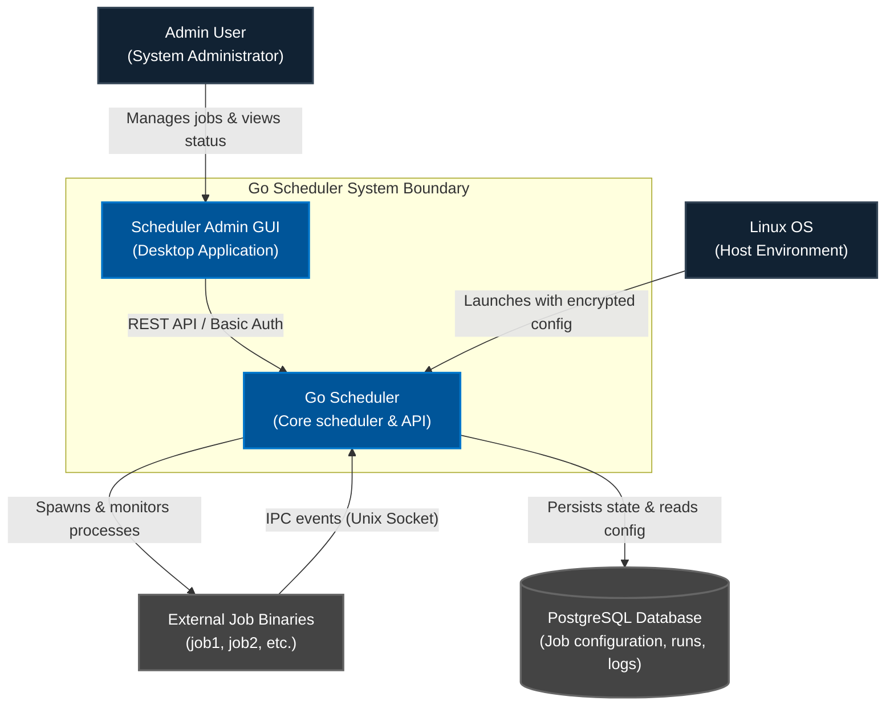

# MitM Scheduler

The **MitM Scheduler** is the orchestration and control component of the MitM-Aggregator pipeline. It sits in the `./scheduler` directory and is responsible for triggering and monitoring the data collection, transformation, and packaging processes.

---

## 📂 Subdirectory Overview

*   **[mitm_scheduler/](file:///home/zb_bamboo/DEV/__NEW__/Go/mitm-2/scheduler/mitm_scheduler)**: The core service directory containing the Go implementation of the command-line scheduler, database configuration loaders, administrative control APIs, and IPC sockets.
    *   Refer to the comprehensive [mitm_scheduler/README.md](file:///home/zb_bamboo/DEV/__NEW__/Go/mitm-2/scheduler/mitm_scheduler/README.md) for database setup, building, and running instructions.

---

## 🏗️ Architectural Role & Features

The scheduler acts as the control panel for the Collector, Transformation, and Delivery layers:

1.  **Job Orchestration**: Executes configured collectors (e.g., [mitm_collector_pg-employee](file:///home/zb_bamboo/DEV/__NEW__/Go/mitm-2/collector-layer/mitm_collector_pg-employee/main.go)) dynamically according to standard cron schedules stored in the database.
2.  **IPC Event Reporting**: Establishes a Unix Domain Socket to receive real-time JSON-formatted status changes (`started`, `processing`, `finished`, `failed`) and security `audit` logs from active jobs.
3.  **Encrypted Configurations**: Uses AES-256-GCM and Argon2id to load encrypted configuration JSON files containing database passwords and authentication tokens.
4.  **Admin API & GUI Control**: Integrates a REST administration endpoint and a Fyne-based GUI desktop admin tool (`cmd/scheduler-admin`) to monitor, configure, reload, and manage scheduled jobs remotely.
5.  **Logging Tables**: Writes core execution trails to PostgreSQL tables (`system_logs`, `job_status_events`, `job_audit_logs`, `admin_audit_logs`).

## C4 System Context Diagram

The System Context diagram shows how the Go Scheduler system interacts with users (Administrators), the host operating system, and the external job binaries it executes.

