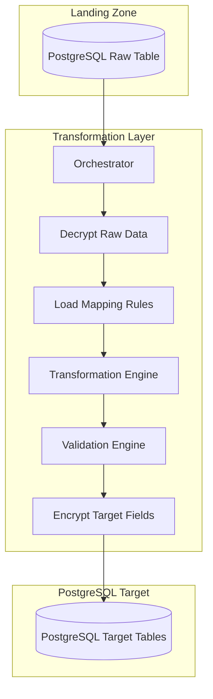
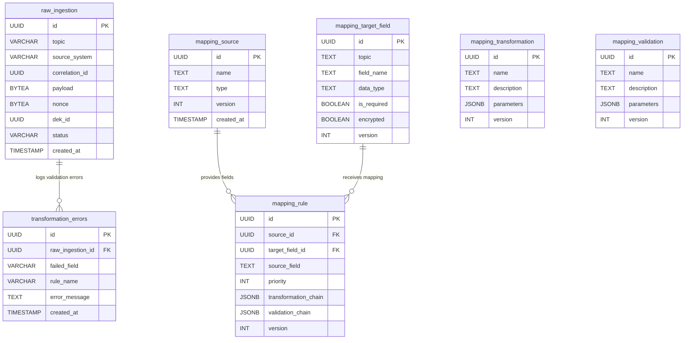
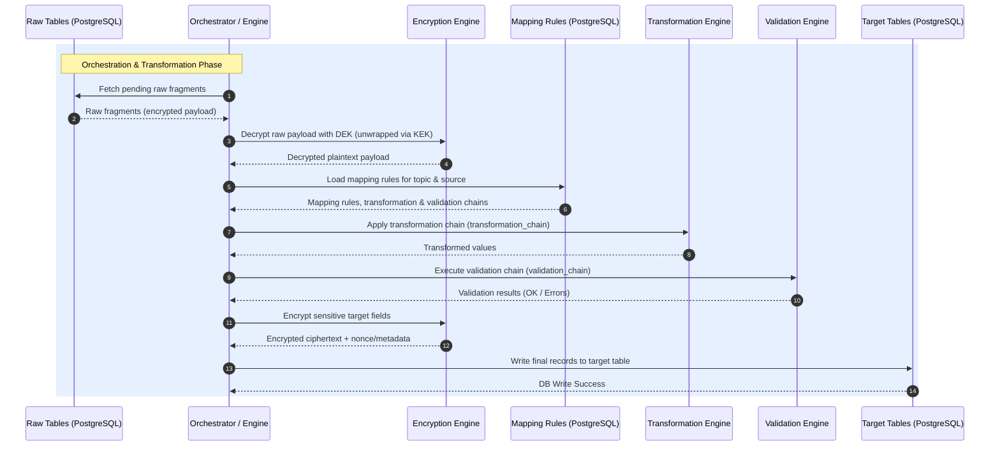

# Transformation Layer Documentation

The **Transformation Layer** (also referred to as the Orchestrator/Transformation Engine) is responsible for reading raw ingested fragments from the database, decrypting them, applying mapping, transformation, and validation rules, encrypting the sensitive target fields, and writing the final data records to target tables.

---

## 🏗️ Architecture & Pipeline

The Transformation Layer acts as an orchestration pipeline:

---

## 📊 Mapping Data Model

The mapping system is modular, allowing you to define dynamic transformations and validation checks for different sources and target topics.

### Entity-Relationship Diagram (ERD)

### SQL Configurations & Schemas

The following configuration schemas define the mapping data model:
*   [001_mapping_source.sql](file:///home/zb_bamboo/DEV/__NEW__/Go/mitm-2/transformation-layer/migrations/001_mapping_source.sql) - Configuration of raw source metadata structures.
*   [001_mapping_target_field.sql](file:///home/zb_bamboo/DEV/__NEW__/Go/mitm-2/transformation-layer/migrations/001_mapping_target_field.sql) - Target schemas and fields definitions, indicating which fields are encrypted or required.
*   [001_mapping_rule.sql](file:///home/zb_bamboo/DEV/__NEW__/Go/mitm-2/transformation-layer/migrations/001_mapping_rule.sql) - Core rule bindings linking source fields to target fields, listing transformation and validation chains.
*   [001_mapping_transformation.sql](file:///home/zb_bamboo/DEV/__NEW__/Go/mitm-2/transformation-layer/migrations/001_mapping_transformation.sql) - Definitions of transformation functions (e.g., date formatting, string manipulation).
*   [001_mapping_validation.sql](file:///home/zb_bamboo/DEV/__NEW__/Go/mitm-2/transformation-layer/migrations/001_mapping_validation.sql) - Definitions of validation rules (e.g., regex checks, value ranges, email format validation).
*   [002_transformation_errors.sql](file:///home/zb_bamboo/DEV/__NEW__/Go/mitm-2/transformation-layer/migrations/002_transformation_errors.sql) - Dead Letter Queue (DLQ) tracking errors during processing.

---

## 🔄 Runtime Flow

## 🛠️ Implementation

The transformation engine is fully implemented in Go under the [`mitm_transformation`](./mitm_transformation) directory. 
It operates as a **CLI Batch Job** orchestrated by a concurrent worker pool.

Key capabilities include:
- **Rule Caching**: Rules are loaded from the database once per run.
- **Dead Letter Queue (DLQ)**: Failing validations are isolated without crashing the pipeline, and can be retried via the `--retry-failed` CLI flag.
- **Envelope Encryption**: Target fields marked as sensitive are encrypted on-the-fly using AES-256-GCM.
- **Concurrency**: High-throughput processing using row-level locking (`FOR UPDATE SKIP LOCKED` / `RETURNING`).
