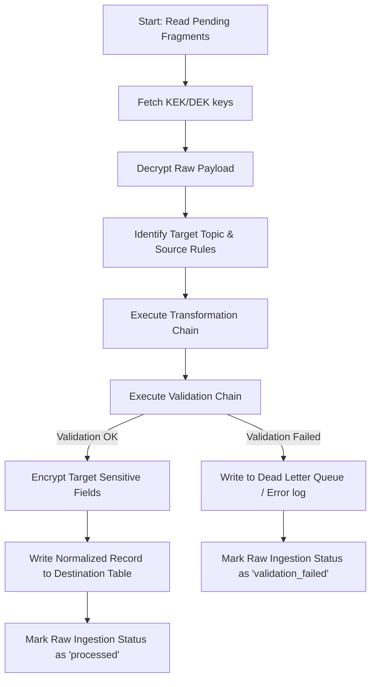
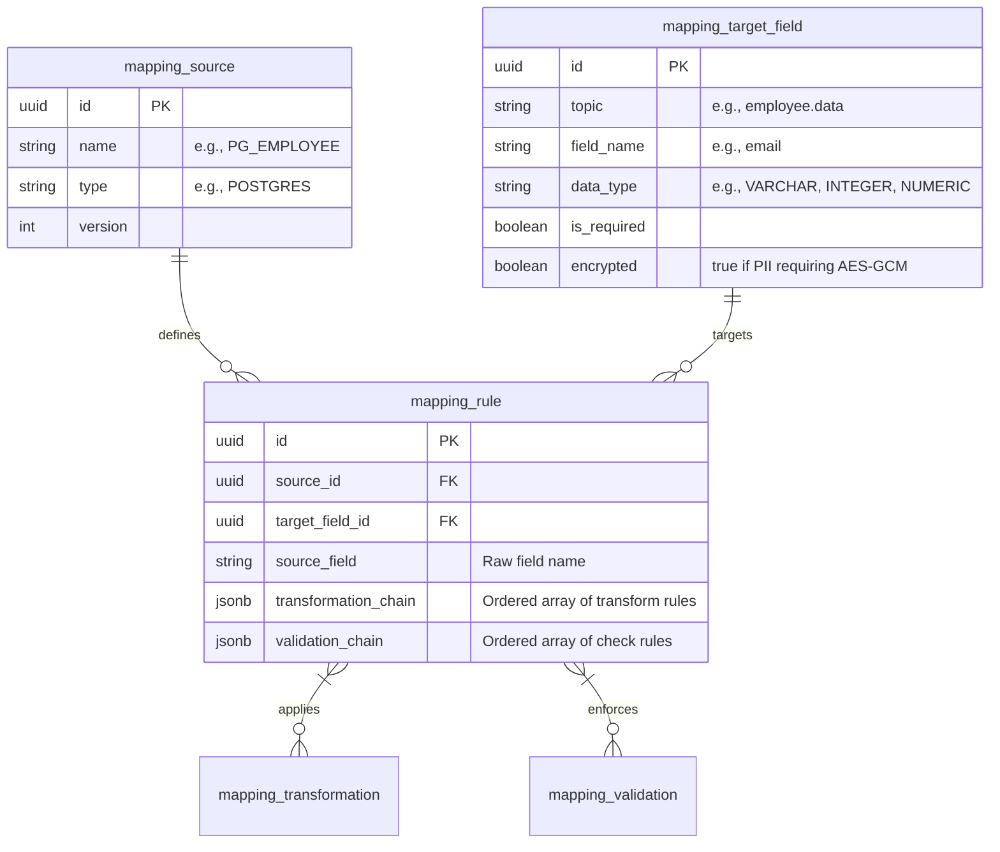

# Concept: Transformation & Validation Engine (Transformation Layer)

## 1. Overview & Objectives

The **Transformation Layer** in the MitM Data Aggregator acts as the processing and cleaning bridge between the raw, schema-agnostic landing zone (`raw_ingestion`) and the structured, normalized target database tables.

The primary objectives of the Transformation Layer are:
1. **Payload Decryption:** Securely load and decrypt the raw ingested payloads using envelope encryption keys (DEK/KEK).
2. **Schema Mapping & Routing:** Dynamically resolve the source-to-target mapping configuration based on database-driven rules.
3. **Data Transformation:** Standardize, format, and normalize raw fields (e.g., parsing date/time string representations, casting numbers, cleaning whitespace).
4. **Data Validation:** Enforce data quality constraints (e.g., checking email formats, regex matching, range checks, and nullability) before database writes.
5. **Envelope Encryption for Sensitive Fields (PII):** Selectively encrypt sensitive target columns using AES-GCM (under target-specific DEKs) prior to storage.
6. **Routing & Delivery:** Save target records to normalized destination tables and handle validation anomalies through a Dead Letter Queue (DLQ) mechanism.

---

## 2. Architecture & Processing Pipeline

The Transformation Engine processes raw fragments using a step-by-step pipeline:



---

## 3. Data Model & Schema Structure

The engine's configuration is managed dynamically in PostgreSQL using five core mapping tables. This model allows updating transformations at runtime without code modifications.



### 3.1. Transformation Chain Struct (`transformation_chain`)
The `transformation_chain` is a JSONB array of transformation tasks executed in sequential order. Each task specifies a transformation name and optional parameters:
```json
[
  {
    "name": "trim_whitespace",
    "parameters": {}
  },
  {
    "name": "regex_replace",
    "parameters": {
      "pattern": "[^0-9\\.]",
      "replace": ""
    }
  },
  {
    "name": "parse_date",
    "parameters": {
      "input_format": "2006-01-02",
      "output_format": "RFC3339"
    }
  }
]
```

### 3.2. Validation Chain Struct (`validation_chain`)
The `validation_chain` is a JSONB array of validators run on the final transformed value:
```json
[
  {
    "name": "not_null",
    "parameters": {}
  },
  {
    "name": "regex_match",
    "parameters": {
      "pattern": "^[a-zA-Z0-9._%+-]+@[a-zA-Z0-9.-]+\\.[a-zA-Z]{2,}$"
    }
  },
  {
    "name": "range_check",
    "parameters": {
      "min": 0.0,
      "max": 1000000.0
    }
  }
]
```

---

## 4. Engine Operations

### 4.1. Core Transformations Library
The engine implements a standard catalog of transformations in Go:

| Function Name | Description | Parameters |
| :--- | :--- | :--- |
| `trim_whitespace` | Removes leading and trailing spaces from a string. | None |
| `to_upper` / `to_lower` | Modifies string casing. | None |
| `default_value` | Inserts a default value if the input field is null or empty. | `{"value": "N/A"}` |
| `regex_replace` | Substitutes occurrences matching a regex with a replacement string. | `{"pattern": "...", "replace": "..."}` |
| `parse_date` | Parses a datetime string and converts it to standard RFC3339. | `{"input_format": "...", "output_format": "..."}` |
| `string_split` | Splits a string into an array and selects an index. | `{"separator": ",", "index": 0}` |
| `cast_type` | Converts values into `int`, `float`, or `bool`. | `{"target_type": "integer"}` |

### 4.2. Core Validations Library
The validation library handles type checking and business logic constraints:

| Validator Name | Description | Parameters |
| :--- | :--- | :--- |
| `not_null` | Ensures the value is not nil, null, or empty string. | None |
| `regex_match` | Checks if the string matches the specified regular expression. | `{"pattern": "..."}` |
| `range_check` | Validates numeric ranges for integers/floats. | `{"min": 0.0, "max": 100.0}` |
| `email` | Validates standard email address syntax. | None |
| `in_list` | Validates that a string value belongs to a list of allowed values. | `{"allowed": ["active", "suspended", "terminated"]}` |

---

## 5. Resilience & Error Handling (DLQ)

Data quality failures during transformation or validation must not crash the orchestrator pipeline. Instead, the engine isolates anomalies:

1. **Transaction Isolation:** Each raw record is processed within its own database transaction boundary (or scoped batch).
2. **Dead Letter Queue (DLQ):** If a record fails validation:
   - The error details (which validation failed, error message, failing field, and raw payload reference) are saved to the `transformation_errors` table.
   - The status of the raw fragment in `raw_ingestion` is set to `failed_validation`.
   - The orchestrator proceeds to the next record.
3. **Reprocessing:** Administrator tools can query the `transformation_errors` logs, allow updating the mapping rules in the configuration tables, and re-trigger processing of records flagged as `failed_validation`.

---

## 6. Implementation Milestones

To implement this design:
1. **Migration Execution:** Apply the SQL configuration schemas defined in `./migrations` to create the mapping registry tables.
2. **Mapping Engine Library:** Create the Go packages in the transformation layer to:
   - Query mapping rules from PostgreSQL.
   - Construct pipeline chains dynamically in Go.
3. **Execution Daemon (Orchestrator):** Implement the daemon that polls `raw_ingestion`, decrypts rows, runs the engine pipeline, and handles outputs to destination tables or error tables.
